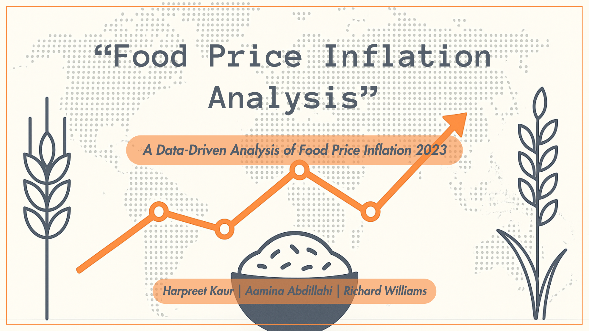
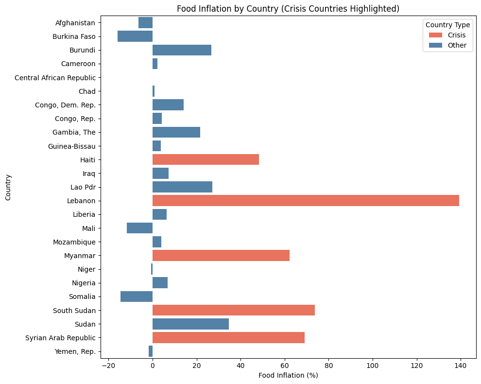
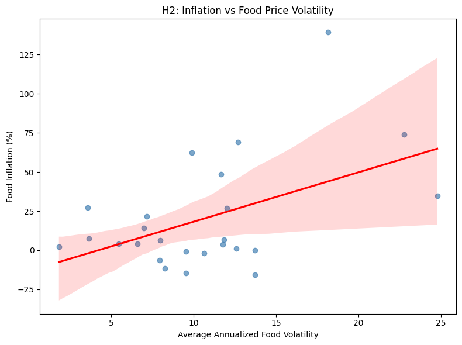
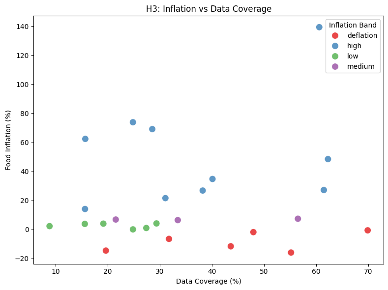
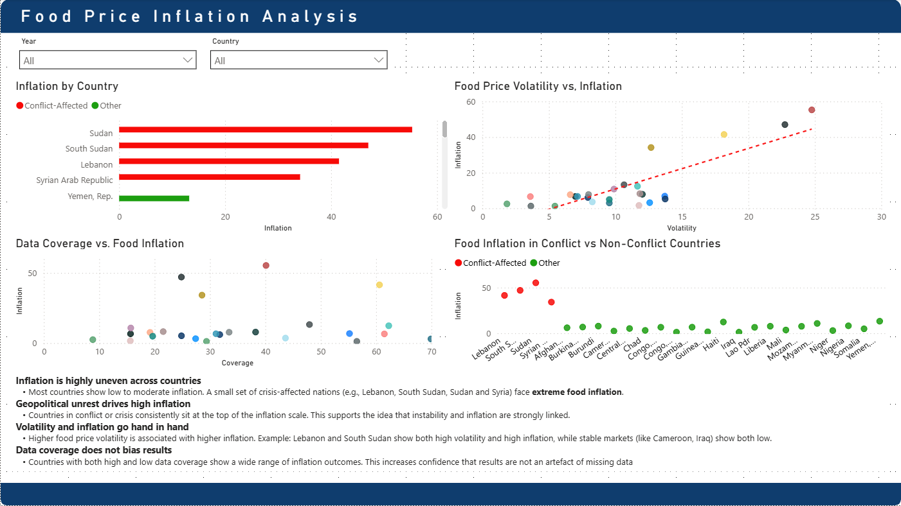

# 

## Food Price Inflation Analysis
***A data-driven analysis of food price inflation***

---

### Executive Summary
This project explores global food price inflation using the Monthly Food Price Estimates dataset from Kaggle.
Our goal was to understand the drivers of food inflation, test hypotheses about volatility and crisis effects, and evaluate the robustness of the data. The analysis provides an evidence-based foundation for communicating results through an interactive dashboard in Power BI.

Key findings:
A small set of countries face extreme inflation and volatility, often linked to crises.
Price volatility amplifies inflationary pressures, making markets unstable.
Data coverage does not bias results, increasing confidence in findings.

### Dataset Content
After data cleaning, the following columns were retained for analysis:
- country: The name of the country where the food price data was recorded.
- iso3: The three-letter ISO 3166-1 alpha-3 code representing the country.
- components: The specific food components or categories included in the price estimation (e.g., cereals, dairy).
- currency: The currency used for pricing in the respective country (e.g., USD, EUR).
- number_of_food_items: The count of distinct food items considered in the price estimation.
- data_coverage_food: The percentage of the total food market covered by the dataset in the respective country.
- average_annualized_food_inflation: The average yearly percentage change in food prices over the available period.
- maximum_food_drawdown: The largest observed decline in food prices during the period, expressed as a percentage.
- average_annualized_food_volatility: The average yearly fluctuation in food prices, indicating market stability.
- date: The specific date when the price data was recorded.
- open: The opening price of the food item on the recorded date.
- high: The highest price reached by the food item on the recorded date.
- low: The lowest price recorded for the food item on the given date.
- close: The closing price of the food item at the end of the recorded date.
- inflation: The percentage change in the food price compared to the previous period, indicating inflation rate.
- year: The year corresponding to the recorded data.
- month: The month corresponding to the recorded data.
- inflation_band: A categorical classification indicating the range of inflation rates (e.g., low, medium, high).

### Business Requirements
The analysis aims to:  
1. Identify **patterns and drivers** of food price inflation.  
2. Test whether **volatility and crises** are associated with higher inflation.  
3. Assess whether **data coverage** biases inflation outcomes.  
4. Provide an **evidence base for stakeholders** via an interactive dashboard.

### Hypotheses
In order to better understand the drivers of food price inflation, we propose the following hypotheses:

### H1 – Geopolitical Unrest and Inflation
- **Null Hypothesis:** There is no relationship between geopolitical unrest or crises and food inflation rates.  
- **Alternative Hypothesis:** Countries experiencing greater geopolitical unrest or crises will have higher food inflation rates.  
- **Rationale:** Conflict disrupts supply chains, weakens currencies, and raises import costs. Outliers such as Lebanon, South Sudan, and Syria suggest that crises may drive extreme inflation.

---

### H2 – Volatility and Inflation
- **Null Hypothesis:** Food price volatility is independent of food inflation rates.  
- **Alternative Hypothesis:** Countries with higher average annualized food price volatility will also have higher inflation rates.  
- **Rationale:** Unstable markets often face upward price pressures. Our scatter plot indicates a moderate positive relationship between volatility and inflation, with countries like Lebanon and Sudan showing both high inflation and volatility.

---

### H3 – Data Coverage and Inflation
- **Null Hypothesis:** Inflation outcomes are influenced by the level of data coverage.  
- **Alternative Hypothesis:** Inflation outcomes are independent of data coverage levels.  
- **Rationale:** If countries with low data coverage systematically showed extreme inflation, results would be questionable. However, our analysis shows extreme inflation even in countries with high coverage, suggesting that inflation results reflect real economic pressures.

---

**Summary:**  
- **H1** explores external, real-world drivers of inflation (geopolitical unrest).  
- **H2** tests an internal relationship within the dataset (volatility vs inflation).  
- **H3** checks data robustness by ruling out potential bias from coverage.

---

### Project Plan
- **ETL Pipeline Development**  
  - Built an end-to-end **Extract, Transform, Load (ETL) pipeline** in Jupyter Notebook.  
  - Extracted the dataset from Kaggle and ingested it into the project workspace.  
  - Transformed raw data through cleaning, formatting, and feature engineering.  
  - Loaded processed data into analysis-ready structures for use in visualisations and hypothesis testing.  

- **Data Cleaning & Feature Engineering**  
  - Verified no missing values or duplicates.  
  - Converted date fields into usable formats.  
  - Engineered derived metrics (absolute drawdowns). 

- **Exploratory Data Analysis**  
  - Univariate analysis of inflation distributions and outliers.  
  - Bivariate testing for volatility, crises, and data coverage effects.  
  - Visual storytelling with bar charts, scatter plots, and boxplots.  

- **Hypothesis Testing**  
  - Assessed evidence qualitatively and quantitatively.  
  - Visualised extreme cases (e.g., Lebanon, Sudan).  

- **Dashboard Creation (Power BI)**  
  - Designed an interactive dashboard summarising inflation trends, country comparisons, and volatility patterns.  

## Data Analysis Summary

In this project, we explored a dataset on **food price inflation** across multiple countries.  
Our analysis followed these main steps:

1. **Data Cleaning & Preparation**
   - Loaded the dataset and parsed the '*date'* column into a usable format.
   - Checked for missing values and duplicates (none found).
   - Verified data types and created a new column for absolute drawdown values.
   - Confirmed data coverage and consistency across countries.

2. **Hypotheses Formulation**
   - **H1:** Countries facing geopolitical unrest will have higher food inflation.  
   - **H2:** Countries with higher food price volatility will also have higher inflation.  
   - **H3:** Inflation outcomes are independent of data coverage levels.

3. **Univariate Analysis**
   - Examined the distribution of food inflation: **positively skewed**, with most countries at low/moderate inflation but a few extreme outliers (e.g., Lebanon at 139%).  
   - Identified several countries in **deflation** (e.g., Burkina Faso, Somalia, Mali).  
   - Summarised key statistics for volatility, drawdown, and coverage.

4. **Bivariate Analysis & Hypothesis Testing**
   - **H1:** Visualised inflation by country, highlighting crisis nations. Found strong qualitative evidence that unrest is linked to high inflation.  
   - **H2:** Scatter plot of inflation vs volatility showed a positive trend, supporting the hypothesis.  
   - **H3:** Scatter plot of inflation vs data coverage showed no systematic bias, supporting data robustness.

5. **Conclusions**
   - Food inflation is highly uneven across countries: most are stable, but a few face extreme crises.  
   - High inflation is often paired with high volatility, compounding instability.  
   - Past drawdowns do not predict current inflation.  
   - Inflation outcomes are not explained by data coverage, strengthening confidence in results.

---

This analysis provides a **clear evidence base** for communicating global food inflation patterns and supports the development of an accessible dashboard for stakeholders.

- **Hypothesis Testing Summary**

We tested three hypotheses using our dataset. The results are summarised below:

### H1 - Geopolitical Unrest and Inflation
- **Result:** Supported qualitatively.  
- Crisis-affected countries (**Lebanon, South Sudan, Syria, Myanmar, Haiti**) are clustered at the top of the inflation distribution.  
- This aligns with global reporting that political/economic instability drives food inflation.  
- Even without a direct “conflict” variable, the evidence suggests unrest is strongly linked to extreme inflation outcomes.

---

### H2 - Volatility and Inflation
- **Result:** Supported.  
- A moderate positive trend is observed: higher food price volatility is associated with higher inflation.  
- Example: **Lebanon, South Sudan, and Sudan** show both high inflation and high volatility, while stable markets like **Cameroon and Iraq** show low levels of both.  
- This reinforces that **price surges often come with instability**.

---

### H3 - Data Coverage and Inflation
- **Result:** Supported.  
- Extreme inflation outcomes appear even in countries with relatively high coverage.  
- Low coverage countries do not systematically show more extreme values.  
- Suggests that results are **robust** and not driven by data artefacts.

---

## Overall Conclusion
- **Food inflation is not evenly distributed**: most countries are stable, but a small set of crisis-affected nations face extreme inflation and volatility.  
- **Volatility amplifies inflation pressures**, highlighting that price surges are also unstable and unpredictable.  
- **Data coverage does not bias results**, increasing confidence in our findings.  

These insights provide a clear, evidence-based foundation for communicating results in our dashboard, showing both the **drivers of food inflation** and the **robustness of the dataset**.

---

## Data Analysis Techniques Used

- **Data Cleaning**
  - Checked and confirmed no missing values or duplicate rows.
  - Converted *'date'* column to datetime format and verified data types.
  - Created derived features (e.g., absolute drawdown values).

- **Univariate Analysis**
  - Summary statistics (mean, median, quartiles, skewness).
  - Histograms and boxplots to show distributions and outliers.
  - Ranking of countries by inflation (top/bottom performers).

- **Bivariate Analysis**
  - Correlation analysis between inflation and other numeric variables.
  - Scatter plots (inflation vs volatility, drawdown, and data coverage).
  - Highlighted extreme cases and outliers with country-level context.

- **Hypothesis Testing (Exploratory)**
  - H1: Compared inflation levels across crisis vs non-crisis countries (qualitative evidence).  
  - H2: Assessed relationship between inflation and volatility (scatter + regression trend).  
  - H3: Checked for bias by comparing inflation against data coverage (scatter).

- **Visualisation**
  - Bar charts (inflation by country, top/bottom 5 comparisons).
  - Scatter plots (with interactive Plotly for hover-based exploration).
  - Boxplots to illustrate skewness and outliers.

### Ethical Considerations
- Data coverage and accuracy vary by country, so results should be interpreted with caution.  
- Food inflation is closely linked to human well-being; presenting results without context risks oversimplifying human suffering.  
- Countries with limited statistical capacity may appear more volatile, introducing bias.  
- This analysis is exploratory and educational, not a policy tool, and findings should not be used in isolation to guide interventions.  

## Dashboard Design

The **Power BI dashboard** was designed to:  
- Provide **quick global insights** through KPIs (average inflation, top/bottom countries).  
- Allow **interactive exploration** with slicers (country, time).  
- Use **scatter plots and bar charts** to show relationships.  
- Apply a **consistent, high-contrast colour scheme** for readability.  
**Due to limitations with the version of PowerBI being used, a link cannot be provided, however, a file is available in the 'dashboard' folder labelled *food_analysis_dashboard*

The design balances clarity for non-technical users with depth for analysts.

### Dashboard Colour Palette

|  Colour  |  Hash Code  |
|----------|-------------|
|  Blue  |  #0f3d6e  |
|  Red  |  #FA1818  |
|  Green  |  #1C9E10  |
|  Black  |  #252423  |
|  White  |  #FFFFFF  |

---

### Limitations

This project was completed under hackathon time constraints and is therefore focused on delivering a **minimum viable analysis and dashboard** rather than a comprehensive study. The dataset itself is relatively small (25 countries, 8 dates), making it more of a snapshot than a long-term global view. While we found strong qualitative evidence that crisis-affected countries face higher inflation, the dataset does not contain a direct measure of geopolitical unrest, so this hypothesis could not be formally tested. Data coverage also varies between countries, and while we found no systematic bias, limited coverage may reduce representativeness for some cases. Finally, many external drivers of food inflation (such as exchange rates, trade restrictions, or humanitarian conditions) were outside the scope of this dataset, meaning results should be interpreted as **exploratory rather than definitive**.

---

### Dataset Cleaning Challenges
Several data quality limitations were encountered during the ETL process:
- **Duplicate Keys**: Resolved 4,773 duplicate key combinations in country-level data, requiring systematic deduplication that may have reduced data granularity
- **Date Parsing**: Multiple date formats required standardisation with some temporal data loss during conversion
- **Numeric Conversion**: String-to-numeric coercion based on pattern matching may have missed edge cases
- **Failed Features**: Some engineered features (e.g., `close_pct_change`) produced empty columns requiring cleanup
- **Data Coverage**: Inconsistent completeness across countries and time periods affects trend analysis reliability
- **String Standardization**: Country/item name harmonisation may have incomplete matches affecting categorical analysis

- **Temporal Limitations**: The dataset spans a fixed historical period, limiting the ability to forecast future food price trends accurately.  
- **Simplification of Complex Factors**: The dataset does not capture all potential drivers of food inflation, such as domestic policies, subsidies, or informal markets.
- - **Lack of information**: There was no direct variable indicating countries affected by conflict; we had to rely on news sources to identify high-conflict countries.  
- **Power BI Limitations**  
  - Some columns (e.g., date, drawdown, volatility) required pre-processing before they could be used effectively in Power BI visuals.  
  - Large datasets can slow performance or limit interactivity in complex dashboards.  
  - Certain calculations (e.g., derived inflation bands) were easier to perform in Python prior to importing the data into Power BI.
- **Interpretation Caution**  
  - Correlations observed in the dataset do not imply causation; findings are exploratory and educational rather than prescriptive.

## Analytical Impact

- Final dataset reduced to 18 validated columns after extensive cleanup
- Countries with sparse data may be underrepresented in analysis
- Extreme outliers (e.g., Lebanon at 139% inflation) retained but require contextual interpretation
- Feature engineering limitations reduced some advanced analytical capabilities

*These limitations reflect real-world data challenges in international economic datasets and highlight the importance of robust validation in hackathon environments.*

### Deployment
- Analysis performed in Jupyter Notebook (Python).  
- Dashboard created and deployed in **Power BI**.  
- Repository hosted on **GitHub** for transparency and reproducibility.  

### Main Data Analysis Libraries
- Python
- Pandas
- NumPy
- Seaborn
- Plotly
- MatPlotLib

### Team Roles
- **Harpreet (Project Manager): ** Oversaw planning, coordination, documentation, and GitHub project management. Also designed and developed the interactive dashboard in Power BI  
- **Aaminah (ETL Lead): ** Handled data extraction, transformation, and preprocessing in Python  
- **Richard (EDA Lead): **

### Reflections
Our team worked collaboratively throughout this project, with each member contributing their skills and insights to ensure a comprehensive analysis. Despite a brief absence from one of the memebers part due to personal reasons, the group maintained strong communication and coordination, which allowed us to stay on track and complete the tasks efficiently. We supported one another in data cleaning, hypothesis testing, and visualisation, fostering a positive and productive working environment.  

Time constraints posed a challenge, limiting our ability to explore certain aspects of the dataset in greater depth. However, we managed to prioritise key analyses and deliver clear, evidence-based findings while maintaining quality. Overall, the experience highlighted the importance of teamwork, flexibility, and effective time management, and it strengthened our ability to collaborate on complex data projects under real-world conditions.

### Credits
- **ChatGPT:** Supported with code guidance, data exploration ideas, markdown writing, and error troubleshooting  
- **GitHub Copilot:** Assisted with syntax and repetitive code blocks during Python scripting  
- **Kaggle:** - Dataset: [Monthly Food Price Estimates](https://www.kaggle.com/datasets/anshtanwar/monthly-food-price-estimates)  
- **Code Institute:** For the project structure and teamwork framework  
- **Team Members:** Harpreet, Aaminah and Richard
-   
### Acknowledgements
Thanks to:
* Code Institute for the project structure
* Kaggle for providing the dataset
* OpenAI for ChatGPT
* GitHub Copilot for coding support
* Code Institute peers for being supportive along the way
